# Git-How-To 
___
## 1. Фінальні приготування

### 1. Встановлюємо ім'я та адресу електронної пошти
- git config --global user.name "Your Name"
- git config --global user.email "your_email@whatever.com"

### 2. Назва гілки за замовчуванням
- git config --global init.defaultBranch main

### 3. Коректна обробка закінчень рядків
- git config --global core.autocrlf input
- git config --global core.safecrlf warn

## Результат:
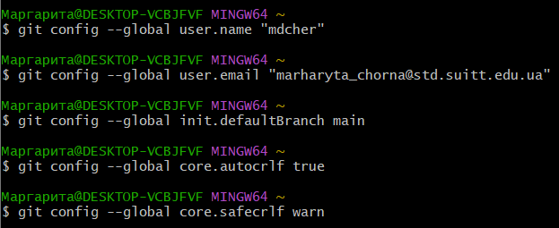

## 2. Створення проєкту

### 1. Створіть сторінку «Hello, World»
- mkdir work
- cd work
- touch hello.html

### 2. Створіть репозиторій
- git init

### 3. Додайте сторінку у репозиторій
- git add hello.html
- git commit -m "Initial Commit"

## Результат:
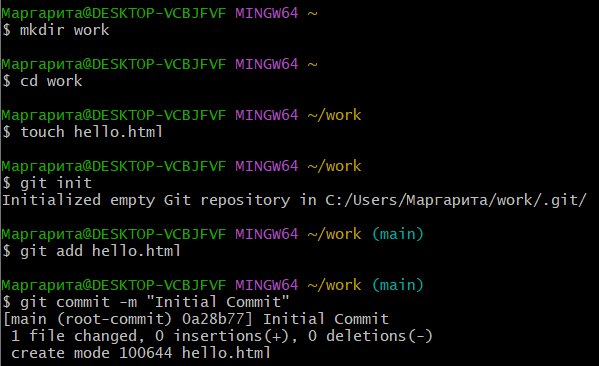

## 3. Перевірка стану

### 1. Перевірте стан репозиторія
- git status

## Результат:
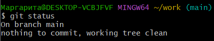

## 4. Внесення змін

### 1. Змініть сторінку «Hello, World»
- <h1>Hello, World!</h1>

### 2. Перевірте стан
- git status

## Результат:


## 5. Індексація змін

### 1. Додайте зміни
- git add hello.html
- git status

## Результат:


## 7. Коміт змін

### 1. Закомітьте зміни
- git commit

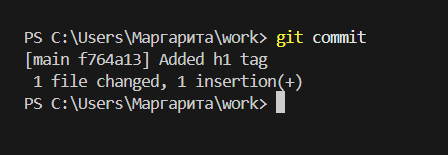

### 2. Перевірте стан
- git status

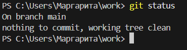

## 8. Зміни, а не файли

### 1. Перша зміна: Додайте стандартні теги сторінок
 html
<html>
  <body>
    <h1>Hello, World!</h1>``````
  </body>
</html>

### 2. Додайте ці зміни
- git add hello.html

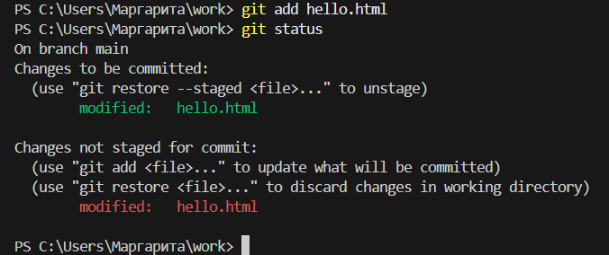

### 3. Друга зміна: Додайте заголовок HTML
<html>
  <head>
  </head>
  <body>
    <h1>Hello, World!</h1>
  </body>
</html>

### 5. Коміт
- git commit -m "Added standard HTML page tags"
- git status

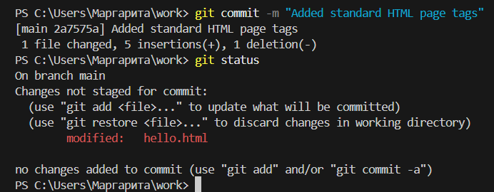

### 6. Додайте другу зміну
- git add .
- git status

### 7. Зробіть коміт другої зміни
- git commit -m "Added HTML header"

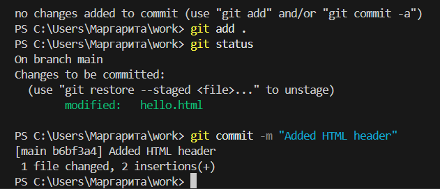

## 9. Історія проєкту

### 1. Отримання списку зроблених змін
- git log

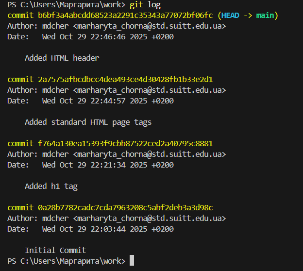

### 2. Однорядкова історія
- git log --pretty=oneline

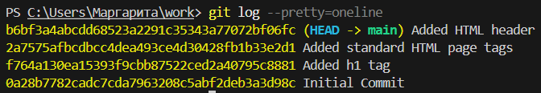

### 5. Кінцевий формат історії
- git log --pretty=format:"%h %ad | %s%d [%an]" --date=short
- git config --global format.pretty '%h %ad | %s%d [%an]'
- git config --global log.date short

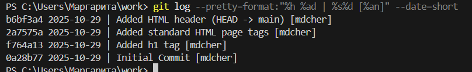

## 10. Отримання старих версій

### 1. Отримайте хеші попередніх комітів
- git log
- git checkout <hash>
- cat hello.html

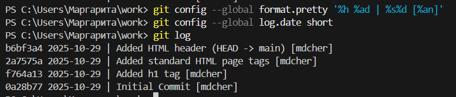

### 2. Поверніться до останньої версії в гілці main
- git switch main
- cat hello.html

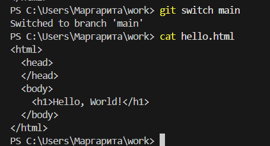

## 11. Створення тегів версій

### 1. Створіть тег першої версії
- git tag v1
- git log

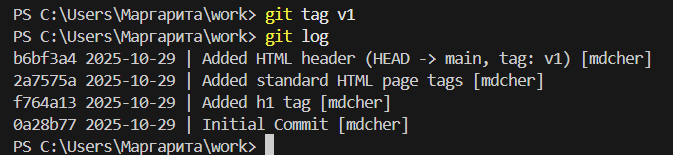

### 2. Теги для попередніх версій
- git checkout v1^
- cat hello.html
- git tag v1-beta
- git log


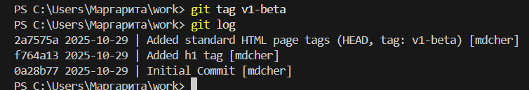

### 3. Перемикання за ім'ям тегу
- git checkout v1
- git checkout v1-beta


### 4. Перегляд тегів за допомогою команди tag
- git tag

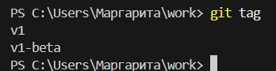

### 5. Перегляд тегів у логах
- git log main --all

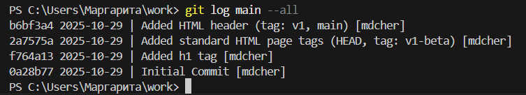
## 12.Скасування локальних змін (до індексації)

### 1. Перейдіть на гілку main
- git switch main

### 2. Змініть hello.html
<html>
  <head>
  </head>
  <body>
    <h1>Hello, World!</h1>
    <!-- This is a bad comment. We want to revert it. -->
  </body>
</html>
### 3. Перевірте стан
- git status

## 4. Скасування змін в робочій директорії
- git restore hello.html
- git status
- cat hello.html

## Результат:
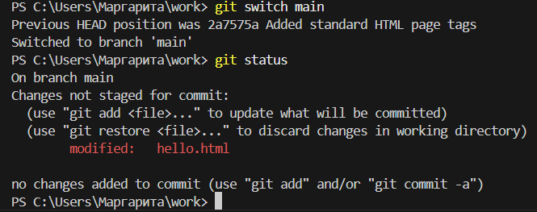
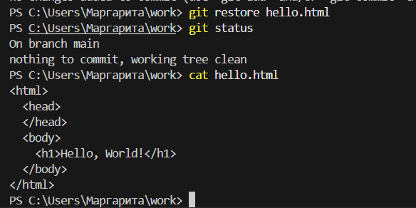

## 13. Скасування проіндексованих змін (перед комітом)

### 1. Внесіть зміни у файл і проіндексуйте їх
<html>
<head>
    <!-- This is an unwanted but staged comment -->
</head>
<body>
<h1>Hello, World!</h1>
</body>
</html> 

- git add hello.html

### 2. Перевірте стан
- git status

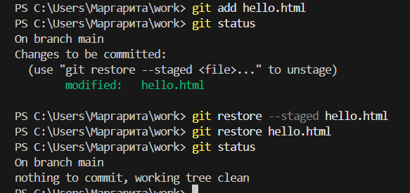

### 3. Відновлення індексу
- git restore --staged hello.html
`
## 4. Відновлення файлу
- git restore hello.html
- git status

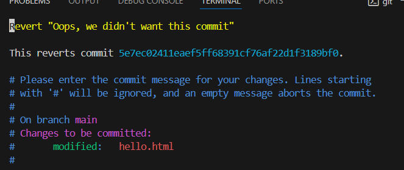

## 14. Скасування комітів
### 1. Змініть файл і зробіть коміт
<html>
  <head>
  </head>
  <body>
    <h1>Hello, World!</h1>
    <!-- This is an unwanted but committed change -->
  </body>
</html>
- git add hello.html
- `git commit -m "Oops, we didn't want this commit"

### 2. Зробіть коміт з новими змінами, що скасовують попередні
- `git revert HEAD`

### 3. Перевірте лог
- git log

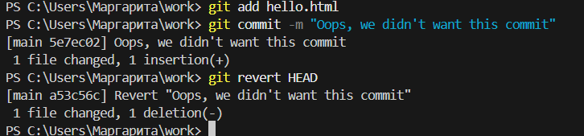

## 15. Видалення комітів з гілки (revert)

### 1. Перевірте нашу історію
- git log

### 2. Для початку позначте цю гілку
- git tag oops

### 3. Відкіт до коміту, що передує до oops
- git reset --hard oops^
- git log

## 4. Нічого ніколи не губиться
- git log --all

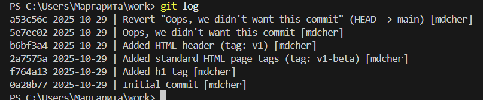
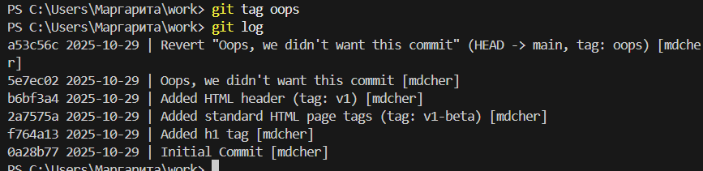

## 16. Видалення тегу oops
- git tag -d oops
- git log --all

## 17. Внесення змін до комітів

### 1. Змініть сторінку, а потім зробіть коміт
<!-- Author: Alexander Shvets -->
<html>
  <head>
  </head>
  <body>
    <h1>Hello, World!</h1>
  </body>
</html>

- git add hello.html
- git commit -m "Added copyright statement"
- git log

### 2. Ой... необхідний email
<!-- Author: Alexander Shvets (alex@githowto.com) -->
<html>
  <head>
  </head>
  <body>
    <h1>Hello, World!</h1>
  </body>
</html>

### 3. Змініть попередній коміт
- git add hello.html
- git commit --amend -m "Added copyright statement with email"

## 4. Перегляд історії
- git log

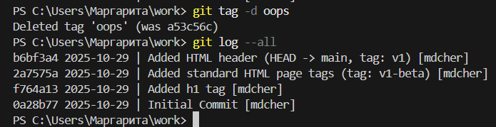
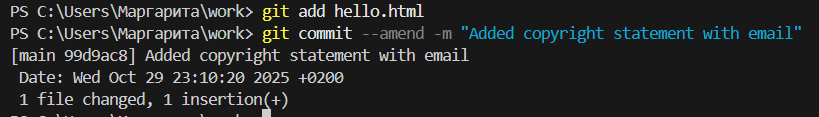
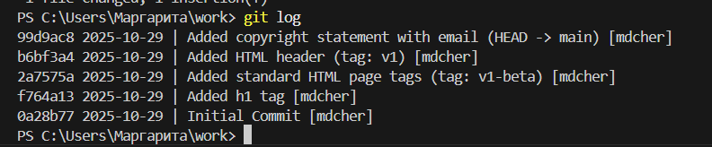

## 18. Створення гілки

### 1. Створіть гілку
- git switch -c style
- git status

### 2. Додайте файл стилів style.css
- touch style.css
h1 {
  color: red;
}
- git add style.css
- git commit -m "Added css stylesheet"

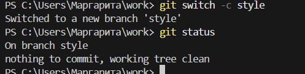
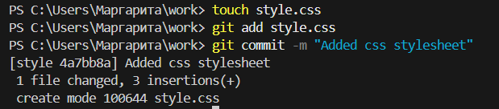

### 3. Змініть hello.html для того, щоб використовувати style.css
<!-- Author: Alexander Shvets (alex@githowto.com) -->
<html>
  <head>
    <link type="text/css" rel="stylesheet" media="all" href="style.css" />
  </head>
  <body>
    <h1>Hello, World!</h1>
  </body>
</html>
- git add hello.html
- git commit -m "Included stylesheet into hello.html"

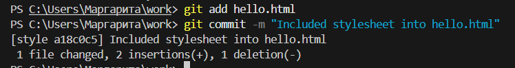

## 19. Перемикання гілок
- git log --all

## 1. Перемкніться на гілку main
- git switch main
- cat hello.html

## 2. Повернемося до гілки style
- git switch style
- cat hello.html

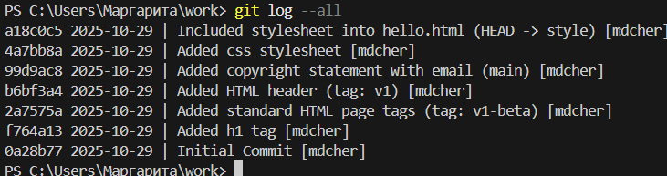
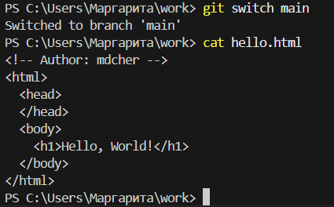
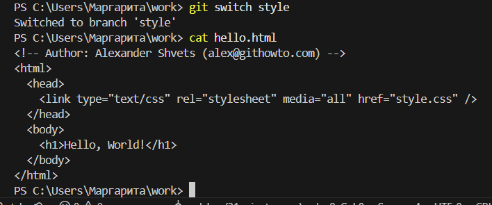

## 20. Переміщення файлів

### 1. Перегляд історії змін конкретного файлу
- git log -- hello.html
- git log -- style.css

### 2. Перегляд різниці між версіями певного файлу
- git show v1

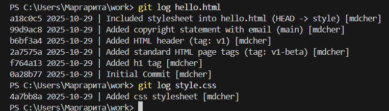
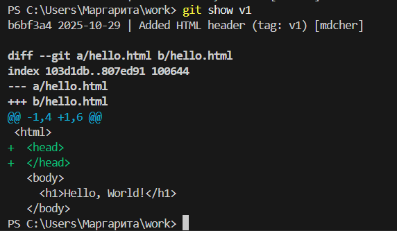

### 3. Перейменуйте hello.html.
- git mv hello.html index.html
- git status
- git add .
- git status

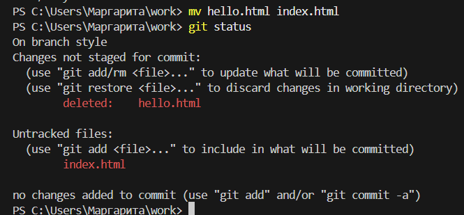
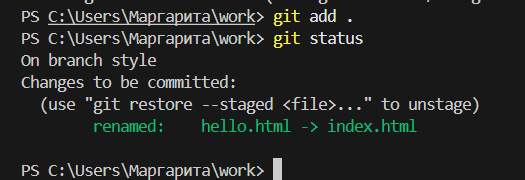

## 4. Безпечне переміщення файлу style.css\- `mkdir css
- mkdir css
- git mv style.css css/style.css
- git status
- git commit -m "Renamed hello.html; moved style.css"
- git log css/style.css
- git log --follow css/style.css

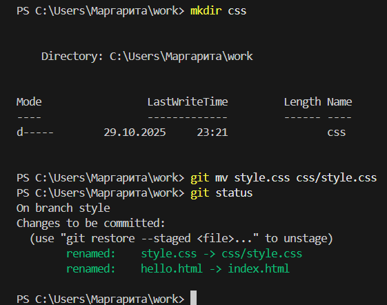
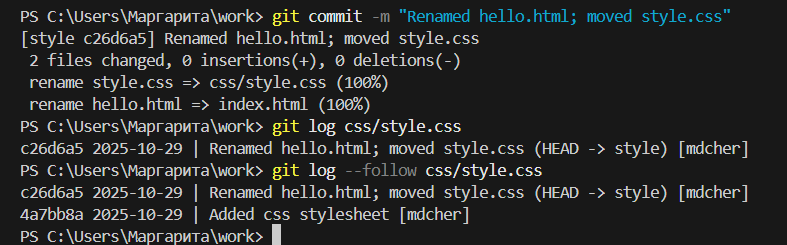

## 21. Зміни в гілці main

### 1. Створіть файл README
This is the Hello World example from the GitHowTo tutorial.
### 2. Закомітьте файл README у гілку main
- git switch main
- git add README.md
- git commit -m "Added README"

'

## 22. Перегляд розбіжних гілок

### Перегляньте поточні гілки
git log --all --graph

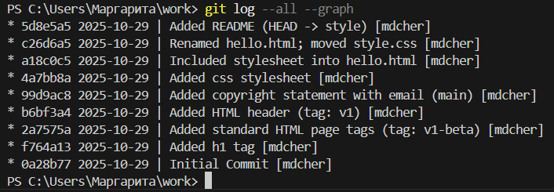

## 23. Злиття

### Злиття гілок
- git switch style
- git merge main
- git log --all --graph


## 24. Створення конфлікту

### 1. Поверніться у main і створіть конфлікт
- git switch main
<!-- Author: Alexander Shvets (alex@githowto.com) -->
<html>
  <head>
    <title>Hello World Page</title>
  </head>
  <body>
    <h1>Hello, World!</h1>
    <p>Let's learn Git together.</p>
  </body>
</html>
- git add hello.html
- git commit -m "Added meta title"

### 2. Перегляд гілок
- git log --all --graph

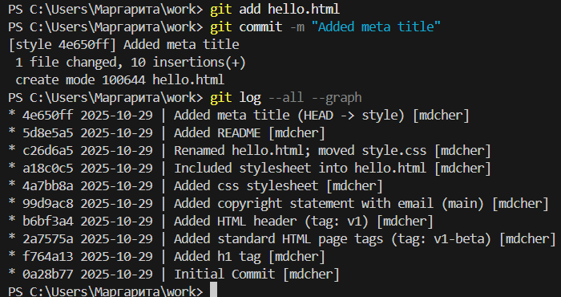

## 25. Вирішення конфліктів
### 1. Злиття main до гілки style
- git switch style
- git merge main
- git status

## 2. Скасування злиття
- git merge --abort
- git status

### 3. Рішення конфлікту
- git merge main
- відредагувати файл до стану, що нас влаштовує
### 4. Зробіть коміт з розв'язаним конфліктом
- git add index.html
- git commit -m "Resolved merge conflict"
- git status
- git log --all --graph

## 26. rebase проти merge

## 27. Відкочування гілки style

### 1.  Відкотіть гілку style
- git switch style
- git log --graph
- git reset --hard HEAD~2


### 2. Перевірте гілку
- git log --graph

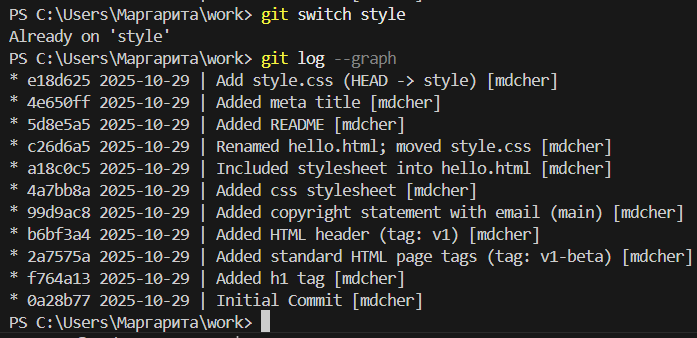
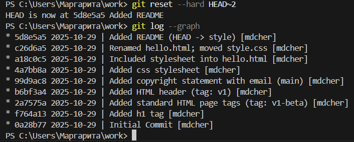

## 28. Перебазування

### 1. Перебазуйте гілку style на main.
- git switch style
- git rebase main
- git status

### 2 . Розв'яжіть конфлікт
- git add .
- git rebase --continue
- git status
- git log --all --graph

## 29. Злиття в гілку main

### 1. Злиття style в main
- git switch main
- git merge style

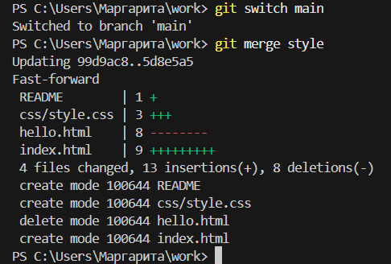

### 2. Перегляньте логи
- git log --all --graph

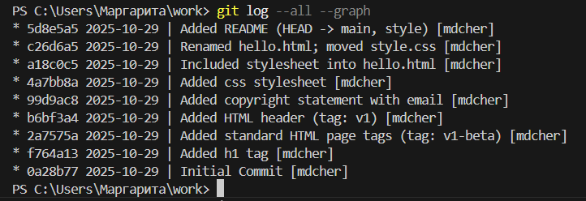
